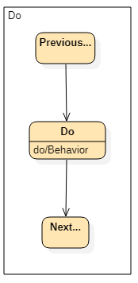
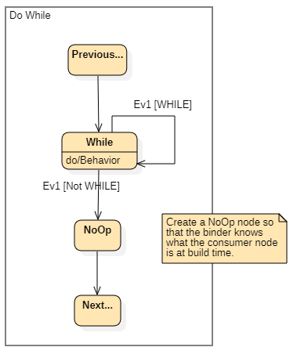

# Sequentials
Build event-driven workflows using pre-defined fragments.

## Example
This example builds a warm-up sequence for a multi-station instrument:
<pre>
public void BuildWarmUp(Sequence sequence)
{
    BeginBuilding(sequence);
 
    var builder = 
	StartWhen("Instrument Configured", c => _instrument.State == InstrumentState.Configured, Trigger.InstrumentState); 
 
    builder
    .IfThen("Station Not Ready", c => _instrument.Station.State != StationState.ClosedEmpty,
            "Remove Chip", c => c.Resolve<InstrumentControl>().RemoveChip().Run(), Trigger.StationState)

    .When("Station Ready", c => _instrument.Station.State == StationState.ClosedEmpty, Trigger.StationState)

    .IfThen("Frame Cover Absent", c => _instrument.CoverSensor.Value == DigitalState.Off,
            "Replace Cover", c => PublishRequestForAction(c, ActionType.ReplaceCover), Trigger.TemporaryCoverTrigger)

    .When("Cover Present", c => _instrument.CoverSensor.Value == DigitalState.On, Trigger.TemporaryCoverTrigger)

    .Do("Warm-Up", c => _instrument.StartWarmUp())
 
    .When("Warm-up Completed", c => _instrument.State == InstrumentState.Idle, Trigger.InstrumentState)

    .Do("Request Preparing Run", c => PublishRequestForAction(c, ActionType.PrepareRun))

    .Finish()

    .ExitAnytime("Instrument Error", 
        c => ((c.IsRegistered<IConfiguration>() && c.Resolve<IConfiguration>().State == ConfigurationState.Error)
              || _instrument.State == InstrumentState.Error),
        Trigger.InstrumentState, Trigger.ConfigState);
 
    CompleteBuild();
}
</pre>

# Fragments
The following UML illustrates the CleanMachine node structures that are pre-defined for each Sequential fragment.

## DO fragment

## DO-WHILE fragment

